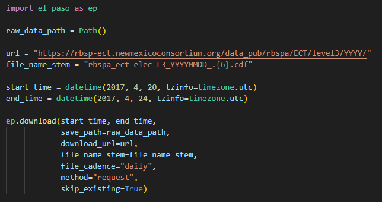
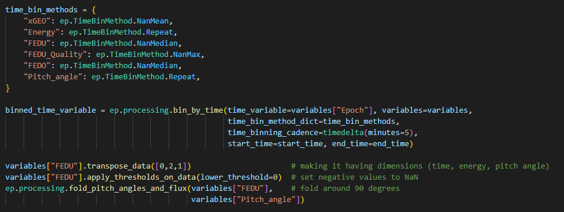
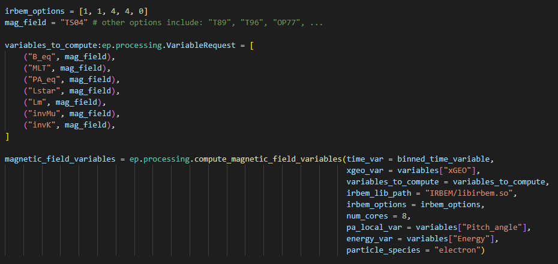
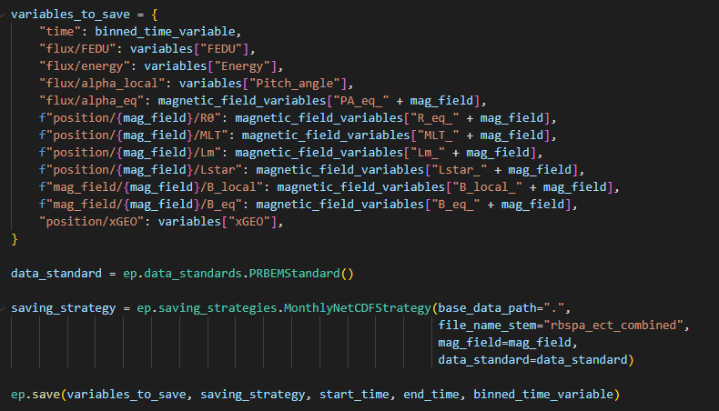

<!--
SPDX-FileCopyrightText: 2025 GFZ Helmholtz Centre for Geosciences
SPDX-FileContributor: Bernhard Haas

SPDX-License-Identifier: Apache 2.0
-->

## Basic Workflow

The workflow of EL-PASO consists of four main steps:

    1. Download of raw data files
    2. Extract data from downloaded files and store it as 'Variables'
    3. Process the extracted variables and compute derived values
    4. Save variables in a pre-defined data standard and file format

### 1. Download of raw data files

Raw data files are usually downloaded from an online repository hosted by an agency. This can be achieved by the internal download routine ([download](../API_reference/download.md)) or by using external tools such as [SPEDAS](https://github.com/spedas/pyspedas) or an API such as [HAPI](https://hapi-server.github.io/).

The download using the EL-PASO routine can be setup using a few lines of code:

You can learn more about the EL-PASO download routine in tutorial #1 located in *tutorials/1_download_data_and_extracting_variables.ipynb*.

!!! note
    The file containing all the code snippets is located at examples/minimal_example.py

### 2. Extract data from downloaded files and store it as 'Variables'

A [Variable](../API_reference/variable.md) in EL-PASO is a custom class which holds a numpy-array as data and metadata (unit, processing notes, etc).

We can turn the downloaded files into variables by calling the EL-PASO [extract_variables_from_files](../API_reference/extract_variables_from_files.md) routine.

The user has to provide information about under which name or column the variable is storred and its unit:

You can learn more about the extraction of variables in tutorial #1 located in *tutorials/1_download_data_and_extracting_variables.ipynb*.

### 3. Process the extracted variables and compute derived values

The next step will consist of multiple processing steps, such as [time binning](../API_reference/processing/bin_by_time.md) or [applying thresholds](../API_reference/variable.md):

We can also calculate derived quantities such as adiabatic invariants (mu, K, L*). The calculations use the [IRBEM library](https://github.com/PRBEM/IRBEM) as a backend and runs parallelized:

You can learn more about processing in tutorials #4 and #5 located in *tutorials*.

### 4. Save variables in a pre-defined data standard and file format

The last step saves the variables in a pre-defined format utizing a data standard.  

The pre-defined format specifies under which names the variables are saved, if the variables are split up in multiple files, and if daily, monthly, or yearly files are created.

The data standard describes the dimensions, units, and names of the data set.
For example, the standard describes that a measurement of the unidirectional differential electron flux has always dimensions of (Time, energy, pitch angle), a unit of 1/(keV str s cm^2), and is called *FEDU*.
In this example, we are applying the [PRBEM standard](https://prbem.github.io/documents/Standard_File_Format.pdf).

You can learn more about different saving file formats and standars in tutorials #3 located in *tutorials*.
